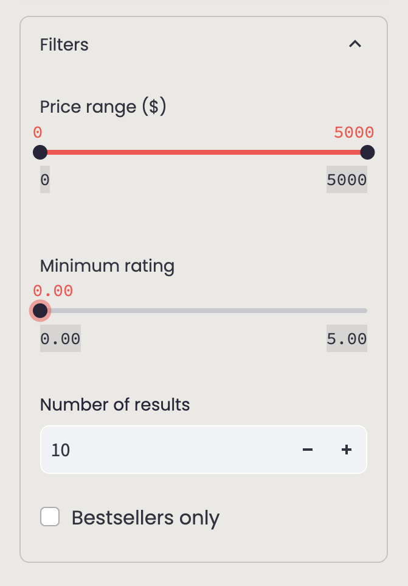
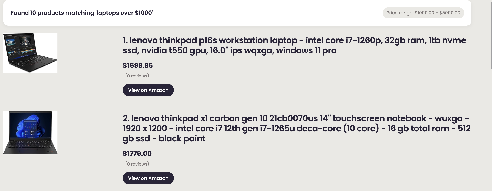

# Amazon Product Explorer

The **Amazon Product Explorer** is a sophisticated product search application built using **FAISS** and **SentenceTransformers** for intelligent product recommendations. It allows users to input natural language product queries and returns relevant Amazon products with details such as price, ratings, and direct links.


## Features

- **Intelligent Product Search**: Find products using natural language queries like "affordable smartphones under $500" or "gaming laptops with good battery life"
- **Advanced Category Filtering**: Automatically detects product categories from your query and prioritizes matching products
- **Comprehensive Price Filtering**: Filter by price range in the query or using the slider controls
- **Rating Filters**: Set minimum rating requirements for product results
- **Bestseller Filtering**: Option to show only bestselling products
- **Responsive UI**: Modern, sleek interface built with Streamlit

## Screenshots

### Main Search Interface


### Filter Options


### Search Results Example


## Dataset

The application uses a comprehensive dataset of Amazon products with the following characteristics:

### Dataset Shape
- **Rows**: 1,385,430
- **Columns**: 11

### Key Columns

| Column Name          | Description                                               |
|----------------------|-----------------------------------------------------------|
| `asin`               | Unique identifier for the product on Amazon               |
| `title`              | The product's title or name                               |
| `imgUrl`             | URL to the product image                                  |
| `productURL`         | URL to the product page                                   |
| `stars`              | Average star rating                                       |
| `reviews`            | Number of reviews                                         |
| `price`              | Price of the product in USD                               |
| `listPrice`          | Original listing price before discounts                   |
| `category_id`        | Category identifier for the product                       |
| `isBestSeller`       | Indicates if the product is a best seller (boolean)       |
| `boughtInLastMonth`  | Shows how often the product was bought in the last month  |

## Technology Stack

- **Python**: Core language for development
- **Streamlit**: Web framework for the user interface
- **FAISS (Facebook AI Similarity Search)**: Creates similarity search indices for efficient product retrieval
- **SentenceTransformers**: Pre-trained transformer models that generate embeddings from product titles and queries
- **pandas & numpy**: Libraries for data processing and manipulation

## How It Works

### 1. Data Processing Pipeline
- **Loading & Cleaning**: The application loads pre-processed Amazon product data
- **Embedding Generation**: Product titles are transformed into vector embeddings using SentenceTransformers
- **Indexing**: Embeddings are indexed with FAISS for efficient similarity search

### 2. Search Functionality
- **Query Understanding**: User queries are analyzed to extract category and price information
- **Semantic Matching**: Queries are converted to embeddings and compared against product embeddings
- **Smart Filtering**: Results are filtered by category, price, rating, and bestseller status
- **Relevance Ranking**: Products are ranked by semantic similarity and category match quality

### 3. User Interface
- **Intuitive Design**: Clean, modern interface with easy-to-use controls
- **Responsive Layout**: Works well on various screen sizes
- **Dynamic Results**: Real-time updates as filters are applied

## Installation and Setup

1. Clone the repository:
```
git clone https://github.com/carlosrod723/Amazon-ProductSupport-Chatbot.git
```

2. Create and activate a virtual environment:
```
python -m venv venv
source venv/bin/activate  # On Windows: venv\Scripts\activate
```

3. Install the required dependencies:
```
pip install -r requirements.txt
```

4. Run the application:
```
streamlit run app.py
```

5. Open the app in your browser (typically at http://localhost:8501)

## Usage Tips

- **Natural Language Queries**: Try queries like "affordable headphones with noise cancellation" or "lightweight laptops with good battery life"
- **Price in Queries**: Include price specifications directly in your query like "smartphones under $400" or "premium cameras $1000-$2000"
- **Category Specificity**: The more specific your category (e.g., "mechanical keyboard" vs just "keyboard"), the better the results
- **Combine Filters**: Use both the search query and filter controls for the most precise results

## License

This project is licensed under the MIT License. See the LICENSE file for more information.